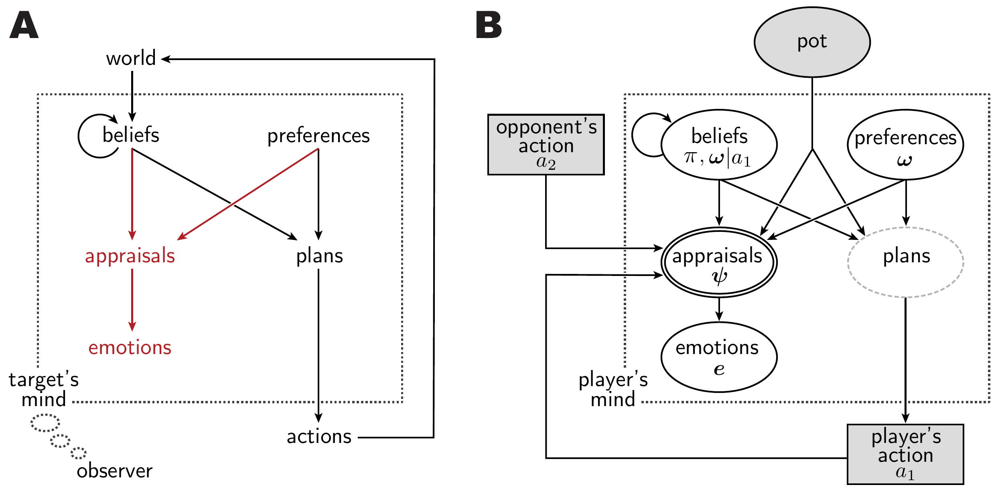

# Emotion prediction as computation over a generative Theory of Mind



**ABSTRACT** From sparse descriptions of events, observers can make systematic nuanced predictions of the emotions of people involved. We propose a formal model of emotion predictions, in the context of a public high-stakes social dilemma. This model uses inverse planning to infer a person's beliefs and preferences based on their action, including social preferences for equity and for maintaining a good reputation. The model then combines these inferred preferences with the outcome to compute 'appraisals': whether the outcome conformed to the expectations and fulfilled the preferences. We learn functions mapping computed appraisals to emotion labels, allowing the model to match human observers' quantitative predictions of twenty emotions, including joy, relief, guilt, and envy. Model comparison indicates that inferred monetary preferences are not sufficient to explain observers' emotion predictions; inferred social preferences are factored into predictions for nearly every emotion. The model can also account for the flexibility of emotion attributions: both human observers and the model consistently use minimal individualizing information to adjust predictions for how different players will respond to the same event. Thus, our framework integrates inverse planning, event appraisals, and emotion concepts in a single computational model, to reverse-engineer people's intuitive theory of emotions.

## Project repository

The GitHub repository ([https://github.com/daeh/computed-appraisals](https://github.com/daeh/computed-appraisals)) provides all of the raw behavioral data, analyses, and models related to the manuscript.

The OSF repository ([https://osf.io/u4zma](https://osf.io/u4zma)) additionally provides the experiments used to collect the behavioral data and cached model output.

## Contents of the project

- `code` - models and analyses 
- `datain` - the raw behavioral data collected from human observers 
- `experiments` - mTurk experiments used to collect the behavioral data in `datain/` (only on the OSF repo)
- `dataOut` - cached model steps (only on the OSF repo)

## Running the project

To run the computed appraisals agent (`caa`) model, you can install the dependencies necessary to regenerate the results and figures using **(1)** [a Docker container](#1-as-a-docker-container) **(2)** [a conda environment](#2-as-a-conda-environment) **(3)** [a pip `requirements` specification](#3-as-a-pip-requirements-specification).

NB Running this model from scratch is prohibitively compute-heavy outside of a High Performing Computing cluster. We have cached the model at various checkpoints to make it easy to explore the results on a personal computer. To make use of the cached model, download and uncompress [dataOut-cached.zip](https://www.dropbox.com/s/vd4u9sxarcfocr7/computedappraisals-cacheddata.zip?dl=0). Then place the `dataOut` directory containing the cached `*.pkl` files in the local project folder that you clone/fork from this repository (e.g. `computed-appraisals/dataOut/`) .

### 1. As a Docker container 

Requires [Docker](https://www.docker.com/). The image includes [WebPPL](https://github.com/probmods/webppl) and [TeX Live](https://www.tug.org/texlive/). 

NB Docker is finicky about the cpu architecture. The example below builds an image optimized for `arm64` processors. For an example of building an image for `amd64` processors, see `.devcontainer/Dockerfile`.

```bash
### Clone git repo to the current working directory
git clone --branch main https://github.com/daeh/computed-appraisals.git computed-appraisals

### Enter the new directory
cd computed-appraisals

### (optional but recommended)
### Add the dataOut/ directory that you downloaded from OSF in order to use the cached model

### Build Docker Image
docker build --tag caaimage .

### Run Container (optional to specify resources like memory and cpus)
docker run --rm --name=caamodel \
    --memory 12GB --cpus 4 --platform=linux/arm64 \
    --volume $(pwd)/:/projhost/ \
    caaimage /projhost/code/react_main.py --projectdir /projhost/
```

The container tag is arbitrary (you can replace `caaimage` with a different label).

### 2. As a conda environment

Requires [conda](https://docs.conda.io/en/latest/), [conda-lock](https://github.com/conda-incubator/conda-lock), and a local installation of [TeX Live](https://www.tug.org/texlive/). If you want to run the inverse planning models, you need to have the [WebPPL](https://github.com/probmods/webppl) executable in your `PATH` with the [webppl-json](https://github.com/stuhlmueller/webppl-json) add-on.

The example below uses the `conda-lock.yml` file to create an environment where the package versions are pinned to this project's specifications, which is recommend for reproducibility. If the lock file cannot resolve the dependencies for your system, you can use the `environment.yml` file to create an environment with the latest package versions. Simply replace the `conda-lock install ...` line with `conda env create -f environment.yml`.

```bash
### Clone git repo to the current working directory
git clone --branch main https://github.com/daeh/computed-appraisals.git computed-appraisals

### Enter the new directory
cd computed-appraisals

### (optional but recommended)
### Add the dataOut/ directory that you downloaded from OSF in order to use the cached model

### Create the conda environment
conda-lock install --name envcaa conda-lock.yml

### Activate the conda environment
conda activate envcaa

### Run the python code
python ./code/react_main.py --projectdir $(pwd)
```

The conda environment name is arbitrary (you can replace `envcaa` with a different label).

### 3. As a `pip` `requirements` specification

If you use a strategy other than [conda](https://docs.conda.io/en/latest/) or [Docker](https://www.docker.com/) to manage python environments, you can install the dependencies using the `requirements.txt` file located in the root directory of the project. You need to have [TeX Live](https://www.tug.org/texlive/) installed locally. If you want to run the inverse planning models, you need to have the [WebPPL](https://github.com/probmods/webppl) executable in your `PATH` with the [webppl-json](https://github.com/stuhlmueller/webppl-json) add-on. 


## Authors

- [Sean Dae Houlihan](https://daeh.info)
- [Max Kleiman-Weiner](http://www.mit.edu/~maxkw/)
- [Luke Hewitt](https://lukehewitt.mit.edu/)
- [Josh Tenenbaum](http://web.mit.edu/cocosci/josh.html)
- [Rebecca Saxe](http://saxelab.mit.edu/)
